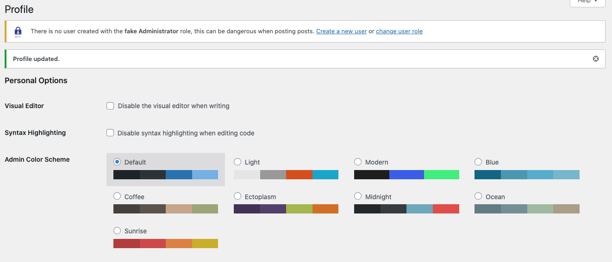
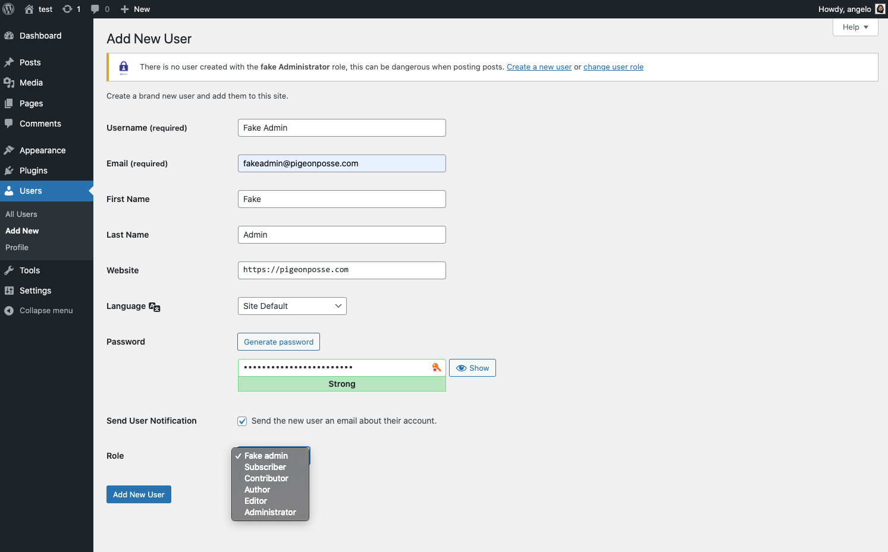
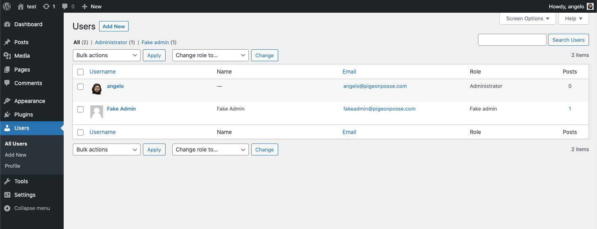
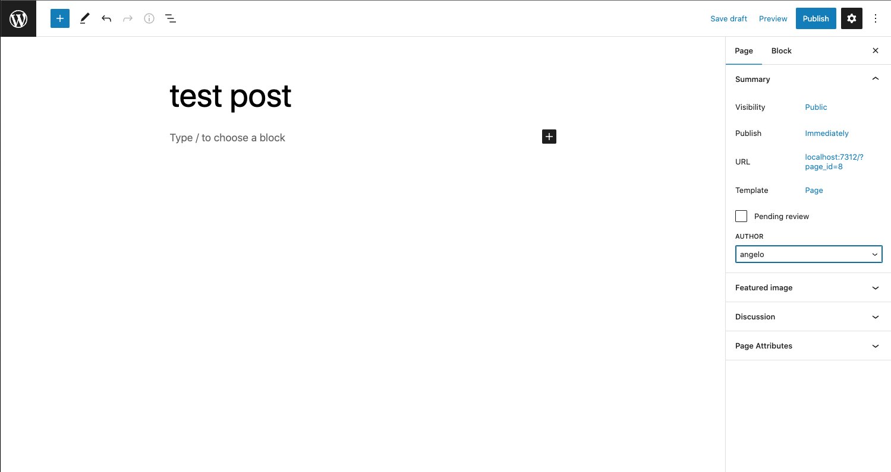
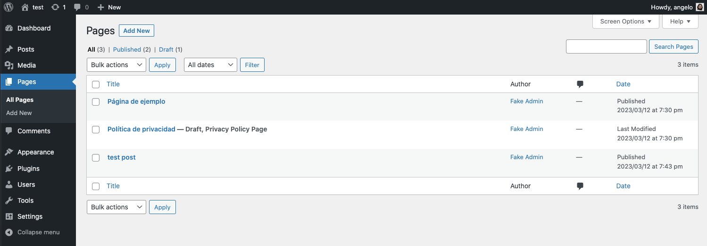

<!-- PIGEONPOSSE START MARK -->
<!--

██████╗ ██╗ ██████╗ ███████╗ ██████╗ ███╗   ██╗
██╔══██╗██║██╔════╝ ██╔════╝██╔═══██╗████╗  ██║
██████╔╝██║██║  ███╗█████╗  ██║   ██║██╔██╗ ██║ 
██╔═══╝ ██║██║   ██║██╔══╝  ██║   ██║██║╚██╗██║ 
██║     ██║╚██████╔╝███████╗╚██████╔╝██║ ╚████║ 
╚═╝     ╚═╝ ╚═════╝ ╚══════╝ ╚═════╝ ╚═╝  ╚═══╝ 
                                                
██████╗  ██████╗ ███████╗███████╗███████╗       
██╔══██╗██╔═══██╗██╔════╝██╔════╝██╔════╝       
██████╔╝██║   ██║███████╗███████╗█████╗         
██╔═══╝ ██║   ██║╚════██║╚════██║██╔══╝         
██║     ╚██████╔╝███████║███████║███████╗       
╚═╝      ╚═════╝ ╚══════╝╚══════╝╚══════╝       
                                                                                                                                                
█████╗█████╗█████╗█████╗█████╗█████╗█████╗█████╗
╚════╝╚════╝╚════╝╚════╝╚════╝╚════╝╚════╝╚════╝ 

███████╗ █████╗ ██╗  ██╗███████╗                
██╔════╝██╔══██╗██║ ██╔╝██╔════╝                
█████╗  ███████║█████╔╝ █████╗                  
██╔══╝  ██╔══██║██╔═██╗ ██╔══╝                  
██║     ██║  ██║██║  ██╗███████╗                
╚═╝     ╚═╝  ╚═╝╚═╝  ╚═╝╚══════╝                
                                                
 █████╗ ██████╗ ███╗   ███╗██╗███╗   ██╗        
██╔══██╗██╔══██╗████╗ ████║██║████╗  ██║        
███████║██║  ██║██╔████╔██║██║██╔██╗ ██║        
██╔══██║██║  ██║██║╚██╔╝██║██║██║╚██╗██║        
██║  ██║██████╔╝██║ ╚═╝ ██║██║██║ ╚████║        
╚═╝  ╚═╝╚═════╝ ╚═╝     ╚═╝╚═╝╚═╝  ╚═══╝                        
                                                
VERSION:    1.0.2 
AUTHOR:     Angelo (https://github.com/AngelEspejo)
REPOSITORY: https://github.com/pigeonposse/fake-admin

DEVELOPED BY PIGEONPOSSE 🐦🌈

-->
<!-- PIGEONPOSSE END MARK -->

# Fake Admin - Wordpress plugin

🕵️‍♀️🔌 Wordpress plugin that prevents your admin user from being exposed to the public.

###

Have you ever published a post or page on ***WordPress*** from your admin account without realizing that you are exposing your admin user to the public? 🙈 It is a common mistake as well as frustrating, especially if your blog is personal and you are the administrator and blog writer.

Do not care anymore! 🤗 With **FakeAdmin** you can prevent your admin user from being publicly exposed.

### How does it work?

The plugin allows you to create a "ghost" user that looks like your admin user, but without the ability to create or edit anything. Once the *FakeAdmin* user is created, as an administrator, you can work on your WordPress site without worrying about exposing your admin user to the public. Everything you create or edit will be attributed to the user *FakeAdmin* and the security of your site will not be compromised.

It's a simple and effective solution! Now you can work on your site with peace of mind knowing that you are protecting your personal information. Test it! 🚀

## 🗝 Prerequisites

- A [Wordpress](https://wordpress.org/download/) installation.

## 🔑 Installation

- Install plugin via [WordPress repository](https://wordpress.org/plugins/).
- Install plugin manually [Download](https://github.com/pigeonposse/fake-admin/releases).

## ⚙️ Usage

#### Create user with "Fake admin" role or change user role with "Fake admin"

|  |  |  |
| -------------- | -------------- | -------------- |

#### Enjoy it!

Now you can create any ***post***, ***page*** or ***post-type*** and if your user is admin automatically change post author to "admin fake" user.

|  |  |
| ------------------------- | ------------------------- |

<!-- PIGEONPOSSE START ORG -->

## 👨‍💻 Development

You can contribute via **_Github_**.

## ☕ Donate

Help us to develop more interesting things.

 

## 📜 License

This software is licensed with ***[GPLv3](/LICENSE)***.

## 🐦 About us

_PigeonPosse_ is a ✨ **code development collective** ✨ focused on creating practical and interesting tools that help developers and users enjoy a more agile and comfortable experience. Our projects cover various programming sectors and we do not have a thematic limitation in terms of projects.

### Collaborators

|                                                                                    | Name        | Role         | GitHub                                         |
| ---------------------------------------------------------------------------------- | ----------- | ------------ | ---------------------------------------------- |
|  | Angelo |   Author   | [@Angelo](https://github.com/AngelEspejo) |
|  | PigeonPosse | Collective	  | [@PigeonPosse](https://github.com/PigeonPosse) |

  

<!-- PIGEONPOSSE END ORG -->