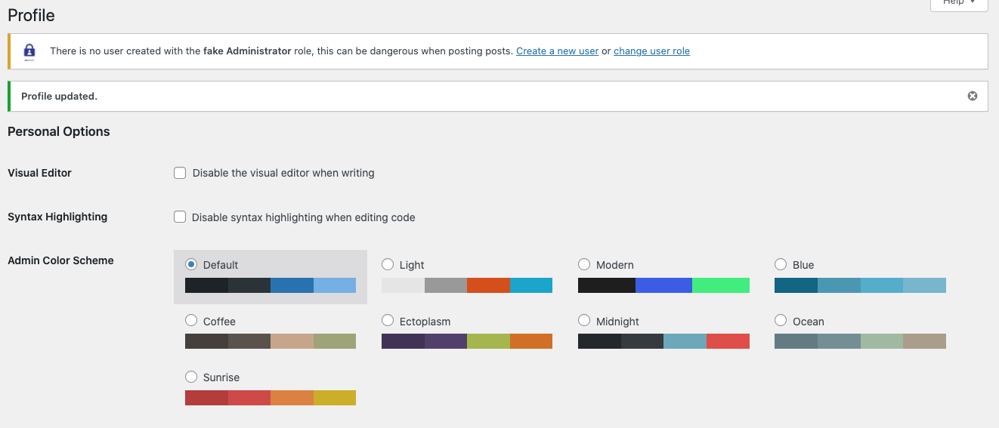
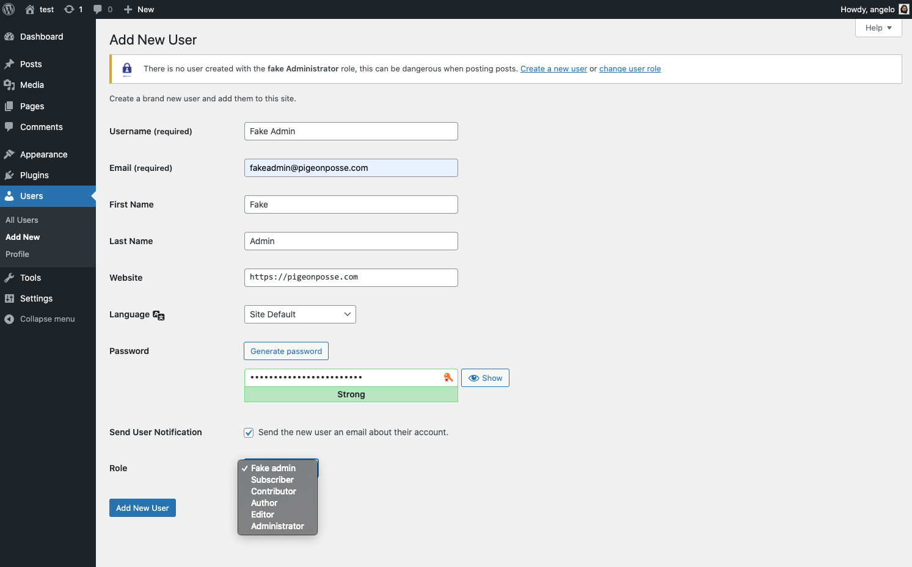
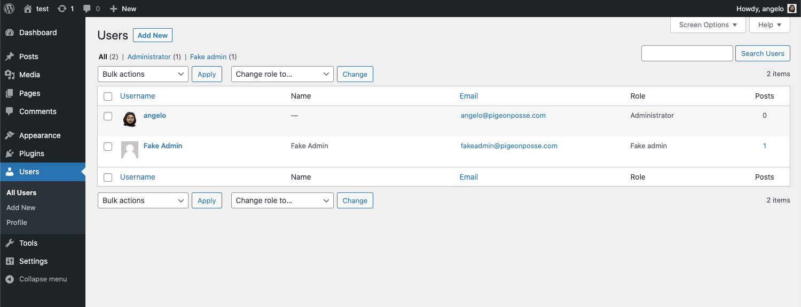
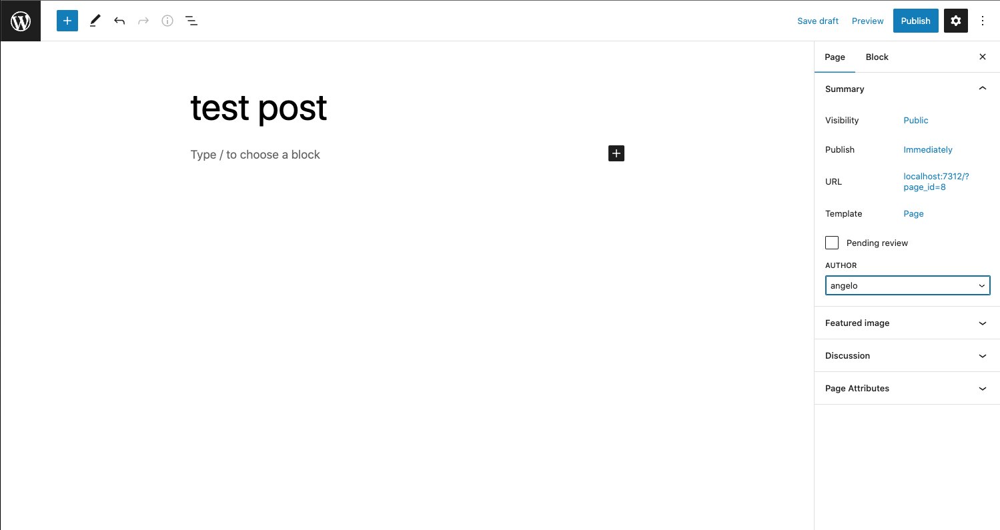
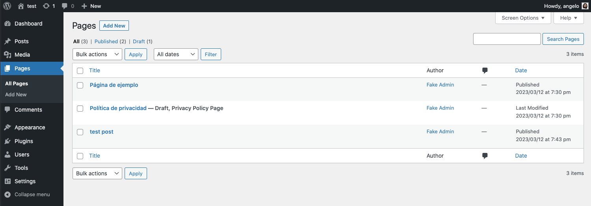

<!-- PIGEONPOSSE START MARK -->
<!--

██████╗ ██╗ ██████╗ ███████╗ ██████╗ ███╗   ██╗
██╔══██╗██║██╔════╝ ██╔════╝██╔═══██╗████╗  ██║
██████╔╝██║██║  ███╗█████╗  ██║   ██║██╔██╗ ██║ 
██╔═══╝ ██║██║   ██║██╔══╝  ██║   ██║██║╚██╗██║ 
██║     ██║╚██████╔╝███████╗╚██████╔╝██║ ╚████║ 
╚═╝     ╚═╝ ╚═════╝ ╚══════╝ ╚═════╝ ╚═╝  ╚═══╝ 
                                                
██████╗  ██████╗ ███████╗███████╗███████╗       
██╔══██╗██╔═══██╗██╔════╝██╔════╝██╔════╝       
██████╔╝██║   ██║███████╗███████╗█████╗         
██╔═══╝ ██║   ██║╚════██║╚════██║██╔══╝         
██║     ╚██████╔╝███████║███████║███████╗       
╚═╝      ╚═════╝ ╚══════╝╚══════╝╚══════╝       
                                                                                                                                                
█████╗█████╗█████╗█████╗█████╗█████╗█████╗█████╗
╚════╝╚════╝╚════╝╚════╝╚════╝╚════╝╚════╝╚════╝ 

███████╗ █████╗ ██╗  ██╗███████╗                
██╔════╝██╔══██╗██║ ██╔╝██╔════╝                
█████╗  ███████║█████╔╝ █████╗                  
██╔══╝  ██╔══██║██╔═██╗ ██╔══╝                  
██║     ██║  ██║██║  ██╗███████╗                
╚═╝     ╚═╝  ╚═╝╚═╝  ╚═╝╚══════╝                
                                                
 █████╗ ██████╗ ███╗   ███╗██╗███╗   ██╗        
██╔══██╗██╔══██╗████╗ ████║██║████╗  ██║        
███████║██║  ██║██╔████╔██║██║██╔██╗ ██║        
██╔══██║██║  ██║██║╚██╔╝██║██║██║╚██╗██║        
██║  ██║██████╔╝██║ ╚═╝ ██║██║██║ ╚████║        
╚═╝  ╚═╝╚═════╝ ╚═╝     ╚═╝╚═╝╚═╝  ╚═══╝                        
                                                
VERSION:    1.0.7 
AUTHOR:     Angelo (https://github.com/AngelEspejo)
REPOSITORY: https://github.com/pigeonposse/fake-admin

DEVELOPED BY PIGEONPOSSE 🐦🌈

-->
<!-- PIGEONPOSSE END MARK -->

<!-- PIGEONPOSSE START HEADER -->
 

 
 

 

<!-- PIGEONPOSSE END HEADER -->

# Fake Admin - Wordpress plugin

<!-- PIGEONPOSSE START DESCRIPTION -->

🕵️‍♀️🔌 Wordpress plugin that prevents your admin user from being exposed to the public.

### Protect Your WordPress Admin User with FakeAdmin

Have you ever published a post or page on _WordPress_ from your admin account without realizing that you are exposing your admin user to the public? 🙈 It is a common mistake as well as frustrating, especially if your blog is personal and you are the **administrator** and blog writer.

Do not care anymore! 🤗 With **FakeAdmin** you can prevent your admin user from being publicly exposed.

### How does it work?

The plugin allows you to create a _"ghost"_ user that looks like your admin user, but without the ability to create or edit anything. Once the **FakeAdmin** user is created, as an administrator, you can work on your _WordPress_ site without worrying about exposing your admin user to the public. Everything you create or edit will be attributed to the user **FakeAdmin** and the security of your site will not be compromised.

It's a simple and effective solution! Now you can work on your site with peace of mind knowing that you are protecting you. 

<!-- PIGEONPOSSE END DESCRIPTION -->

## 🗝 Prerequisites

- A [Wordpress](https://wordpress.org/download/) installation.

## 🔑 Installation

1. Install plugin _(2 ways)_
	+ Via [WordPress repository](https://wordpress.org/plugins/fake-admin).
	+ Manually [Download](https://github.com/pigeonposse/fake-admin/releases) & Upload plugin to the “/wp-content/plugins/” directory.

2. Activate the plugin through the “Plugins” menu in WordPress.

## ⚙️ Usage

#### Create user with "Fake admin" role or change user role with "Fake admin"

|  |  |  |
| -------------- | -------------- | -------------- |

#### Enjoy it!

Now you can create any ***post***, ***page*** or ***post-type*** and if your user is admin automatically change post author to "admin fake" user.

|  |  |
| ------------------------- | ------------------------- |

  

  

<!-- PIGEONPOSSE START ORG -->

## 👨‍💻 Development

You can contribute via **_Github_**.

## ☕ Donate

Help us to develop more interesting things.

 

## 📜 License

This software is licensed with ***[GPLv3](/LICENSE)***.

## 🐦 About us

_PigeonPosse_ is a ✨ **code development collective** ✨ focused on creating practical and interesting tools that help developers and users enjoy a more agile and comfortable experience. Our projects cover various programming sectors and we do not have a thematic limitation in terms of projects.

### Collaborators

|                                                                                    | Name        | Role         | GitHub                                         |
| ---------------------------------------------------------------------------------- | ----------- | ------------ | ---------------------------------------------- |
|  | Angelo |   Author   | [@Angelo](https://github.com/AngelEspejo) |
|  | PigeonPosse | Collective	  | [@PigeonPosse](https://github.com/PigeonPosse) |

  

<!-- PIGEONPOSSE END ORG -->